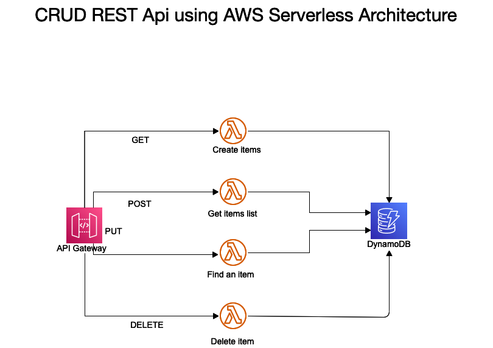

# SAM DynamoDB CRUD Application for Managing Items

This is a sample application to demonstrate how to build an application on DynamoDB using the
[DynmoDbEnhancedClient](http://docs.aws.amazon.com/sdk-for-java/latest/reference/software/amazon/awssdk/enhanced/dynamodb/DynamoDbEnhancedClient.html) to manage DynamoDB table to a RESTful API for Store shop items management.

# Project architecture

