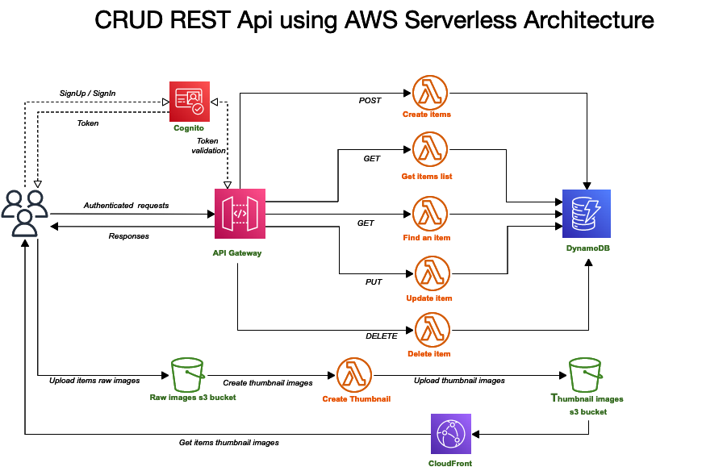

# SAM DynamoDB CRUD Application for Managing Items

This is a sample application to demonstrate how to build an application on DynamoDB using the
[DynmoDbEnhancedClient](http://docs.aws.amazon.com/sdk-for-java/latest/reference/software/amazon/awssdk/enhanced/dynamodb/DynamoDbEnhancedClient.html) to manage DynamoDB table to a RESTful API for Store shop items management.

## Project Architecture

 

## Components

**Functions**

1. CreateItemHandler

Lambda function to save items into the DynamoDb

2. GetItemsHandler

Lambda function to list items available in DynamoDb

3. FindItemHandler

Lambda function to find specific item in DynamoDb

4. UpdateItemHandler

Lambda function to update a specific in DynamoDb

5. DeleteItemHandler

Lambda function to delete a specific in DynamoDb

6. CreateThumbnailHandler

Lambda function to create  thumbnail images from items raw images

